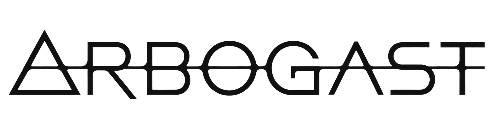

<p align="center">
  
</p>

<p align="center">
  <strong>Certificate-first computational mathematics for finite cohomology,
  symmetry, and Hurwitz arithmetic.</strong>
</p>

> “What does this?” she said at last. She’d meant it as a rhetorical question. Of course there
> was no answer. No force known to humanity could do what had just been done.

<p align="center">
  <a href="https://github.com/azide0x37/arbogast/actions/workflows/ci.yml"></a>
  <a href="https://www.python.org/downloads/"></a>
</p>

Arbogast is for computations that are finite enough to check, large enough to distribute,
and delicate enough that “the script returned this” is not an acceptable proof boundary.
It keeps exact computations, imported facts, deductions, and conjectures separate, then joins
them in a machine-readable **claim graph**.

```text
mathematical input
       │
       ▼
decompose → aim → obstruct → frame → certify
                                         │
                                         ▼
                                    ClaimGraph
                                  ╱      │      ╲
                         cheap verifier paper   agent / Lean export
```

Discovery may be expensive. Verification should not be.

## The motivating workflow: Antieau, Klüners, and Malle

The supplied Antieau interview describes a Klüners--Malle research workflow around explicit
polynomials and the database built from that work. Arbogast uses that account as a motivating
case study rather than attributing a new polynomial request to Antieau: begin with a precisely
scoped arithmetic target, import only the prior-work claims actually supported by the
[Klüners--Malle database](https://galoisdb.math.uni-paderborn.de/), and turn construction,
bounded search, and exact verification into auditable tasks. A modern campaign needs more than a
database lookup or a long-running process.

Arbogast models the work in three durable layers:

```text
Claim  ←  Task  ←  Campaign
  │         │          │
  │         │          ├── objective, budget, capability requirements, policy
  │         ├───────────── canonical inputs, operation contract, checkpoints, receipts
  └─────────────────────── statement, derivation, evidence, source, theorem status
```

The campaign first imports the exact Klüners--Malle assertion it is allowed to use, then
decomposes the target into construction, search, and exact-verification tasks. A candidate
polynomial is not the claim. A worker exit is not the claim. Even a correct finite certificate is
not the whole claim until its hypotheses, derivation, and imported dependencies are bound in the
claim graph.

This matters most when no polynomial is found. The ledger records **mathematical outcome**
separately from **operational state**; an interrupted worker cannot become a negative theorem.
Compact campaign reports use the following explicit classifications:

| State | Mathematical meaning |
| --- | --- |
| `FOUND` | A replayable certificate verifies a witness meeting the target's stated success criterion. |
| `PROVED_IMPOSSIBLE` | A certificate proves nonexistence under the stated hypotheses. |
| `SEARCH_EXHAUSTED` | A declared finite search domain was completely checked; nothing broader follows. |
| `BUDGET_EXHAUSTED` | Work stopped at its recorded resource limit; the unexplored region remains open. |
| `PREEMPTED` | Execution was interrupted; resume requires a typed checkpoint and an executor that owns its custody. |
| `FAILED` | Software, input, or environment failed; this has no negative theorem content. |
| `UNKNOWN` | Available evidence does not justify a stronger classification. |

The authoritative research state is the campaign ledger: targets, canonical plans, planned task
specs, task and attempt events, per-metric candidates, resource use, result and typed-checkpoint
references, outcomes, embedded closure certificates, and claim bindings. The surrounding
`Campaign` owns the canonical `ClaimGraph`; accepting a verified closing observation creates and
binds its computed claim. Task capability requirements and the campaign's declared local
capability set feed planning; 0.1 reports incompatible tasks through status and explanation
blockers without inventing a failure event for work that never started. Later planners can
consume recorded provenance as algorithm input, so a bounded negative result can rule out a
repeated strategy or sharpen the next task rather than disappearing into logs.

Arbogast 0.1.0 includes deterministic local executors and extension protocols. Cooperative
operations can yield typed single- or multi-shard checkpoint manifests to
`WorkerPoolExecutor`; the basic `LocalExecutor` deliberately cannot replay checkpoint custody, so
its checkpoint successor is reported as `SUSPEND`, not `RESUME`. This is not arbitrary process
or host crash recovery. The release does not claim built-in SSH deployment, Slurm orchestration,
cloud provisioning, remote license handling, or workstation reconstruction. Reproducibility
means another machine can recover the same canonical claim and verify its evidence; it need not
recreate the original workstation or repeat an expensive discovery schedule. See
[Research campaigns](docs/research-campaigns.md).

## What 0.1.0 is—and is not

Arbogast 0.1.0 is an alpha **finite exact core**. It provides canonical finite objects, exact
linear algebra and finite-group computations, explicit low-degree cohomology,
finite Nielsen and braid-action machinery, certificates, claim graphs, deterministic work
planning, and export surfaces. The pure-Python path is intentionally small and auditable.

The release does **not** claim a general computer algebra system, a general
Galois-cohomology engine, a deformation-theory solver, or an automatic theorem prover. It does
not promote
floating-point evidence to exact mathematics. Lean export produces structured finite proof
obligations; it does not mean that every exported claim is already a Lean theorem. External
systems such as GAP, FLINT, PARI/GP, SageMath, and Magma are optional capabilities: Arbogast
detects them and reports their absence rather than bundling or impersonating them.

The five verbs are a research workflow, not a claim that every future mathematical domain is
implemented in 0.1.0:

- **decompose** an object into exact, symmetry-adapted pieces;
- **aim** a witness at stated local, isotypic, or combinatorial constraints;
- **obstruct** an impossible aim with an explicit finite witness;
- **frame** choices so automorphisms and conventions cannot silently move the problem;
- **certify** the result in a compact, independently checkable form.

See [the theorem boundary](docs/theorem-boundaries.md) for the exact epistemic contract.

## Install

Arbogast 0.1.0 requires Python 3.11 or newer. Pin the exact GitHub source tag with
[uv](https://docs.astral.sh/uv/):

```bash
uv add "arbogast @ git+https://github.com/azide0x37/arbogast.git@v0.1.0"
```

For a contributor checkout:

```bash
git clone https://github.com/azide0x37/arbogast.git
cd arbogast
uv sync --extra dev
uv run arbogast version
```

No external algebra backend is required for the core examples. If an operation can use an
external backend, install that system independently and inspect capability discovery before
depending on it. The optional 0.1.0 execution surface is limited to FLINT matrix rank/determinant
and GAP permutation-group order, each returned as typed discovery evidence rather than a theorem
certificate; see [Optional backends](docs/optional-backends.md).

## Thirty-second tour

The smallest complete example computes \(H^1(C_5, M)\) over \(\mathbf F_{11}\), inspects
representatives, and verifies the quotient certificate:

```bash
uv run python examples/group_cohomology/cyclic_action_h1.py
```

The same example through the public API:

```python
from arbogast.cohom import h1
from arbogast.linalg import DenseMatrix, FiniteField
from arbogast.rep import CyclicGroup, Representation

group = CyclicGroup(5)
field = FiniteField(11)
generator_action = DenseMatrix(
    field,
    ((1, 0, 0), (0, 3, 0), (0, 0, 4)),
)
module = Representation.from_generators(group, field, (generator_action,))

weights = module.weight_spaces()
result = h1(group, module)

print(result.dimension)
for cocycle in result.representatives:
    print(cocycle)

result.verify()  # reconstructs and checks the finite certificate
claim = result.claim()  # records the computed assertion and evidence
claim.verify()
```

Here `result.dimension == 0`: because 5 is invertible modulo 11, positive-degree cohomology
vanishes. The runnable example also shows that \(Z^1\) and \(B^1\) both have dimension 2 and
checks the split weights 1, 3, and 4. Result objects carry mathematical data and provenance;
public computations do not return unexplained tuples of matrices and dimensions.

## Claim graphs are the centerpiece

A transcript tells you what a program printed. A claim graph tells you what mathematics was
asserted, why, from which inputs, and with what evidence.

Every claim answers five questions:

| Field | Question |
| --- | --- |
| `what` | What precise mathematical fact is asserted? |
| `why` | Which earlier claims does it use? |
| `how` | Was it imported, computed, or derived? |
| `evidence` | Which content-addressed certificate checks it? |
| `source` | Which source objects or literature records does it import? |

Claim kinds are data, not prose decoration: `ASSUMED`, `IMPORTED`, `COMPUTED`, `DERIVED`, and
`CONJECTURED` are never silently interchanged. A separate epistemic status records `EXACT`,
`CERTIFIED`, `CONDITIONAL`, `NUMERICAL`, `HEURISTIC`, or `UNKNOWN`. A computation can be exact
while a theorem derived from an imported hypothesis remains conditional; those are different
axes.

```bash
# List only theorem holes in a saved graph.
uv run arbogast claims claim-graph.json --kind conjectured

# Summarize the obligations between a claim and a machine proof.
uv run arbogast proof-gap claim-graph.json --claim claim.id
```

`proof-gap` accepts only canonical `arbogast.claim-graph/v1`, `arbogast.claim/v1`, or
`arbogast.proof-gap/v1` documents. A `ProofGap` is bound to the same claim ID and contributes to
that claim's canonical digest; it describes formalization work without changing mathematical
status. Ad-hoc JSON with an `obligations` field is rejected.

Read [Claims and certificates](docs/certificates-and-claims.md) for the schema and trust
boundary.

## CLI

The CLI is intentionally inspection- and verification-oriented:

```text
arbogast version [--json]
arbogast describe OPERATION [--json]
arbogast verify CERTIFICATE [--verifier NAME] [--json]
arbogast claims FILE [--status STATUS] [--kind KIND] [--json]
arbogast proof-gap FILE [--claim CLAIM_ID] [--json]
arbogast route --from TYPE --to TYPE [--include-unimplemented] [--json]
arbogast campaign init NAME FILE [--objective TEXT] [--success-criterion TEXT ...] [--json]
arbogast plan FILE [--limit N] [--json]
arbogast run FILE [--fleet {off,auto}] [--limit N] [--json]
arbogast status FILE [--json]
arbogast target FILE TARGET --explain [--json]
arbogast harvest FILE [--observation OBSERVATION_JSON] [--json]
arbogast export claims FILE [OUTPUT] [--json]
```

Examples:

```bash
uv run arbogast describe cohom.h1 --json
uv run arbogast route --from NielsenClass --to ClaimGraph
uv run arbogast verify certificate.json
```

`describe` exposes mathematical preconditions, guarantees, failure modes, exactness, shard
strategy, certificate type, and alternative required input bundles. `route` searches a capability
hypergraph: every operation step requires its complete conjunctive input bundle, while genuine
alternative unary inputs remain separate routes. It is not a promise that value-level
preconditions hold; missing transformations are reported as missing capabilities.

Campaign files serialize specifications, their campaign-owned `ClaimGraph`, and the authoritative
event ledger, never executable Python callables. With the default `--fleet off`, `run` fails
closed if the current runtime has no injected implementation for a named operation.
`--fleet auto` creates an audited local worker pool and registry, but 0.1.0 deliberately
registers only `fleet.echo.v1`; it returns `UNKNOWN` and is control-plane plumbing, not a
mathematical verifier or a way to execute code named by JSON. The runnable campaign example shows
trusted local operation injection through the Python API. `harvest` accepts only a strict
`Observation` document, not arbitrary worker JSON. `export claims` emits the directly replayable
canonical `arbogast.claim-graph/v1` owned by the campaign. Lower-level closure-candidate receipts
remain an explicit Python audit surface; they are not the exported theorem graph.

## Python API

The public surface is organized by mathematical layer:

| Layer | Purpose |
| --- | --- |
| `arbogast.core` | Immutable canonical objects, encodings, artifacts, and hashes |
| `arbogast.linalg` | Exact dense and sparse linear algebra over supported finite fields |
| `arbogast.rep` | Finite groups, permutations, representations, invariants, and decompositions |
| `arbogast.cohom` | Cochain complexes and explicit \(H^0\), \(H^1\), \(H^2\) results |
| `arbogast.hurwitz` | Nielsen classes, braid orbits, real structures, and components |
| `arbogast.claims` | Typed claims, theorem dependencies, and epistemic status |
| `arbogast.cert` | Discovery receipts and independent verification certificates |
| `arbogast.fleet` | Deterministic task specs, shards, artifact stores, and reduction |
| `arbogast.campaign` | Campaign-owned claim graphs, plans, tasks, attempts, candidates, observations, and policies |
| `arbogast.sinks` | Authoritative local campaign-ledger sinks and readback |
| `arbogast.backends` | Honest capability probes for optional external systems |
| `arbogast.agent` | Bounded operation contexts, module manifests, hazards, capability routes, and a declared code DAG |
| `arbogast.export` | Stable JSON, agent, paper, and Lean-facing representations |

For architecture and dependency direction, see [Architecture](docs/architecture.md).

## Runnable examples

### Exact group cohomology

[`examples/group_cohomology/cyclic_action_h1.py`](examples/group_cohomology/cyclic_action_h1.py)
is the sub-second hello world. It constructs a cyclic action over \(\mathbf F_{11}\), computes
\(H^1\), exposes explicit representatives and quotient data, and verifies the result.

### An exact M23 real-component certificate

[`examples/hurwitz/m23_real_component/`](examples/hurwitz/m23_real_component/) is the flagship
finite certificate. A checked-in witness dataset exhausts 7,114 product-one inner orbits for the
passport \((2A,3A,6A,2A)\): exactly 1,428 generate the pinned M23 and the other 5,686 are
intransitive. Six standard pure-braid generators act transitively on the generating class.

A separate standard-library verifier checks the M23 Schreier chain, class and product witnesses,
the exhaustive inner-orbit partition, 8,568 serialized forward braid transitions, their inverse
closure, and the complete straight-real action. The fixture manifest binds the actual public
`arbogast.hurwitz.m23_exact` verifier source by SHA-256 and byte length, in addition to binding
the witness dataset and compatibility entrypoint. Verification runs without GAP and without
repeating the search, then emits six `COMPUTED`, `CERTIFIED` claim nodes.

The real census preserves its exact scope: the real involution fixes 70 generating inner classes,
while 20 satisfy the stricter literal \(c=1\) condition. Those 20 exhaust the generating inner
Nielsen class, not all product-one tuples; the fixture explicitly verifies 212 strict \(c=1\)
representatives in the nongenerating complement. GAP generation remains discovery provenance,
not part of the verifier's trusted base.

### Prove without search

[`examples/certificates/prove_without_search/`](examples/certificates/prove_without_search/)
contains two programs. `discover.py` searches for a witness and writes a certificate.
`verify.py` intentionally knows nothing about the search strategy and checks only the emitted
finite evidence. This is the core design in miniature.

### A local research campaign

[`examples/campaigns/antieau_klueners_malle/`](examples/campaigns/antieau_klueners_malle/)
runs a small deterministic local analogue of the motivating workflow. It records imported prior
work, a persisted plan, capability matching, attempt states, a canonical target-scoped candidate,
and an explicit terminal state in an authoritative ledger. The imported statement starts in the
campaign-owned graph; the verified closure observation automatically adds and binds the computed
claim. The example independently replays both the registered residue-scan certificate and the
campaign claim envelope, then reloads the same graph from the campaign snapshot. It does not
contact the Klüners--Malle database or a remote scheduler at runtime.

## Reproducibility and theorem boundaries

Arbogast distinguishes these layers:

```text
source/input → canonical object → discovery receipt → verification certificate
                                                       │
                                                       ▼
                                                   computed claim
                                                       │
                                      imported claims ─┤
                                                       ▼
                                                   derived claim
```

- A successful search is not yet a verified result.
- A verified finite result is not automatically a published theorem.
- A field of moduli is not silently treated as a field of definition.
- Real branch data is not silently promoted to a rational model.
- Source-curve genus and Hurwitz-component genus are different invariants.
- Backend discovery does not make the backend part of the verifier's trusted base.

The conventions that make certificates portable are recorded in
[Mathematical conventions](docs/mathematical-conventions.md).

## Agents, papers, and Lean

Claim graphs can be projected into small, task-oriented views:

- generated module manifests name purpose, types, operations, invariants, `do_not` guardrails,
  and declared code-dependency nodes;
- bounded agent contexts add complete operation contracts, resolved hazards, implemented routes,
  unimplemented frontier edges, the separate code DAG, and acceptance-bearing task packets;
- paper exports separate assumptions, computational propositions, and deductions;
- Lean-facing exports render claim and proof-obligation records, preserving classifications,
  hypotheses, context, evidence, and discharge metadata.

The theorem `ClaimGraph`, semantic `CapabilityGraph`, declared `CodeDependencyGraph`, and
`AgentTask.dependencies` have different meanings and are never inferred from one another. Code
dependencies come from explicit operation/module/backend declarations, not Python import scans.
Explicit context records are atomic under `max_chars`: an undersized budget raises instead of
silently dropping a guarantee or guardrail.

The 0.1.0 Lean exporter emits structured obligation data, claim annotations, and theorem axioms
only when the conclusion and every hypothesis supply explicit Lean renderings; emitted axioms
retain those hypotheses as implications. It does not invoke Lean, translate
arbitrary matrix or orbit certificates, or claim that an axiom has been proved. Rich finite
witness bridges—such as rank witnesses, orbit trees, and completeness partitions—remain explicit
future work. See [Agent and Lean exports](docs/agent-and-lean-exports.md).

## Development

```bash
uv sync --extra dev
uv run ruff check .
uv run ruff format --check .
uv run mypy
uv run pytest
uv build
```

CI runs lint, formatting, strict typing, tests, builds, and every bundled example on Python
3.11, 3.12, 3.13, and 3.14. Contributions must preserve deterministic serialization and
theorem boundaries; start with [CONTRIBUTING.md](CONTRIBUTING.md).

## License boundary

No open-source license has been selected for 0.1.0. The public source and release artifacts are
therefore source-visible but all rights are reserved unless and until the copyright holder grants
additional permission.

## Status and citation

Arbogast 0.1.0 is alpha research software. Certificate verification is intended to be small
and inspectable, but users remain responsible for auditing the hypotheses and imported facts
of any theorem they rely on. See [SECURITY.md](SECURITY.md) for reporting integrity or
parser issues and [CITATION.cff](CITATION.cff) for citation metadata.

Release history is in [CHANGELOG.md](CHANGELOG.md).
